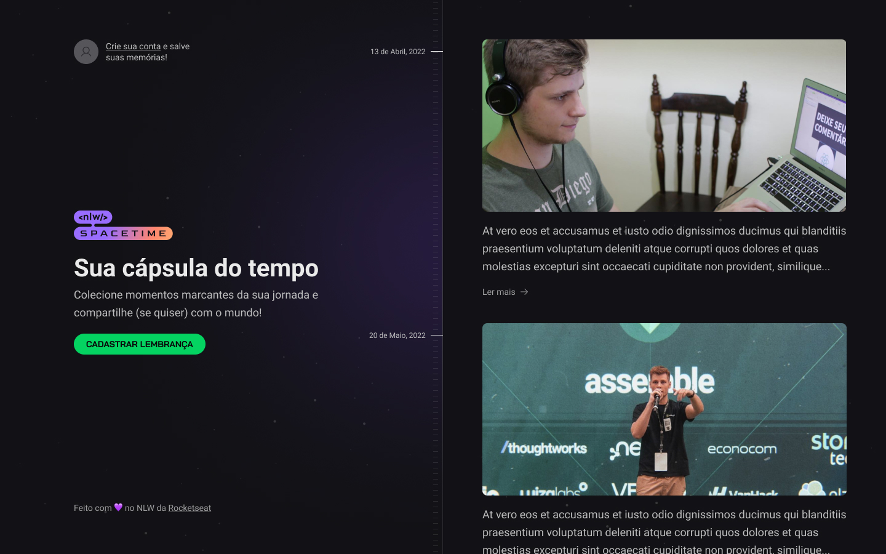

<h1 align="center">
  💻 NLW Spacetime
</h1>
<h1 align="center">
  
</h1>

## 📑 Sobre

Projeto desenvolvido durante a semana de imersão de um evento da RocketSeat, com intuito de construir uma aplicação com um widget que poderia ser usado em aplicações web e mobile para guardar as memórias do usuário, seja por fotos ou vídeos.

---

## 🚀 Tecnologias utilizadas

- 💻 Front-end: Next.js, TypeScript, Tailwind CSS
- ☁️ Back-end: Node.js, TypeScript, Fastify, Prisma
- 📱 Mobile: React Native, Expo, TypeScript, Nativewind

---
## 🧑‍💻 Autor

<table>
  <tr>
    <td align="center">
      <a href="github.com/guixavier77">
         
        
          <b>Guilherme Xavier</b>
        
      </a>
    </td>
  </tr>
</table>